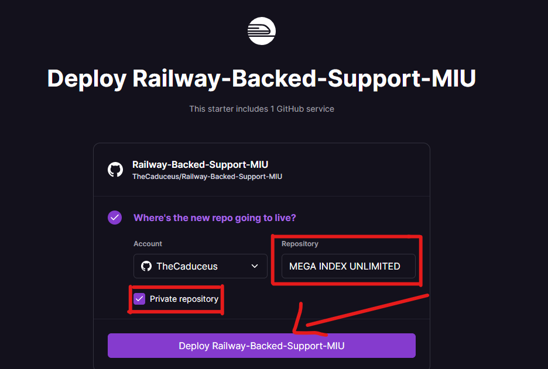
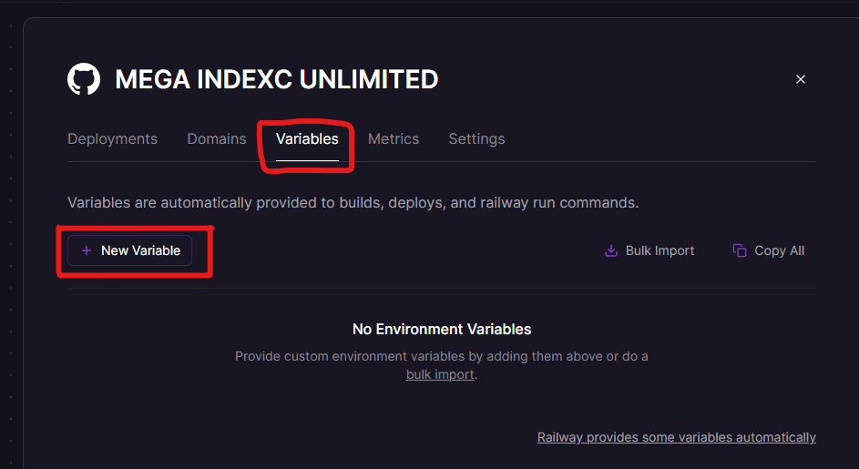
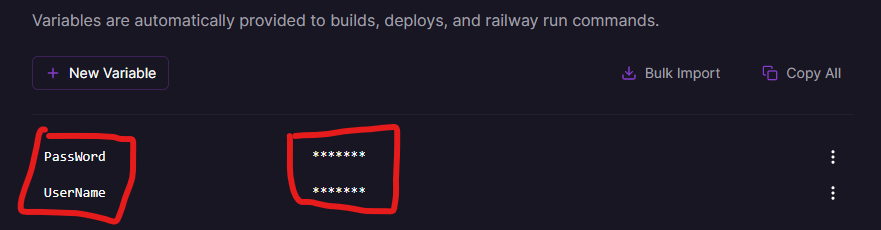
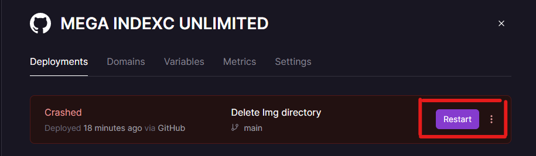

# MEGA INDEX (UNLIMITED! 😊)
<b>The Most Advanced Mega Index to Download Large Files without any Quota Limit!🔥</b>
## 📑Features
<h4><b>1.Download Limit Bypassed!😍</b></h4>
<h4><b>2.Permanent Working Links!😎</b></h4>
<h4><b>3.No Account Ban!😏</b></h4>
<h4><b>4.Most Simplified!😊</b></h4>
<h2>⚙️How to use?</h2>
<h3><b>Deploy on Heroku:</b></h3>
<h4><b>1.First Open the App Deployment Page On Heroku: <a href="https://dashboard.heroku.com/new?template=https://github.com/TheCaduceus/MEGA-INDEX">Open it!</a></b></h4>

<h4><b>2.Now Enter a Unique App Name and Username/Email & Password of your Mega Account Carefully! and click Deploy Button</b></h4>

<h4><b>3.After Deployment Click "View App" Button and it will open a Website which is your Mega Drive Index! That sit Enjoy!😎</b></h4>

<b>❗The URL of your MEGA INDEX will be in this format: https://appname.herokuapp.com/❗</b>

<h3><b>Deploy on Railway</b></h3>
<h4><b>1.First Open the App Deployment Page On Railway: <a href="https://railway.app/new/template?template=https://github.com/TheCaduceus/Railway-Backed-Support-MIU">Open it!</a></b></h4>
<h4><b>2.Now Click Login with GitHub if you are new one! And then give a best Name to the Repository as shown in the Image! But don't forget to check "Private Repository" option to prevent your Password from getting leaked.</b></h4>

<b>❗Don't forget to check "Private Repository" option otherwise Railway will make a seperate Public Repository on GITHUB and anyone can view your MEGA Email ID and Password.❗</b>

<h4><b>3.After creating New Project! It will crash because you have not added Email ID and Password For MEGA, For adding this Go to Variable Tab and create Two Variables as follows:</b></h4>

<b>UserName // Your "Email ID" of MEGA Account</b>

<b>PassWord // Your "Password" of MEGA Account</b>

<h4><b>4.After adding above Values! Click Restart Button in Deployment Tab and wait for maximum 10 Minutes.</b></h4>

<b>❗Restarting takes Max 10-15 Minutes to Start the INDEX and Establish the Secure Connection with MEGA Servers.❗</b>

<h4><b>5.If you deploy your INDEX using Railway, will give you ability to add a custom Domain for your INDEX without adding any card unlike Heroku Do! The by default URL for your INDEX will be like this "https://PROJECT-NAME-ENVIRONMENTNAME.up.railway.app/"</b></h4>
<h2>〽️Variables Used</h2>
<h3><b>For Heroku</b></h3>
<h4><b>1.MEGA_EMAIL_ID: Enter your Registered Email ID in small.</b></h4>
<h4><b>2.MEGA_PASSWORD: Enter Password of your Registered Mega Account Carefully.</b></h4>

<b>---</b>

<h3><b>For Railway</b></h3>
<h4><b>1.UserName: Enter your Registered Email ID in small.</b></h4>
<h4><b>2.PassWord: Enter Password of your Registered Mega Account Carefully.</b></h4>
<h2><b> 🔐 Safe or Not? ✅</b></h2>
<h4><b> 1.Don't Worry! No data will be shared with anyone, if you use the <a href="https://github.com/TheCaduceus/MEGA-INDEX">Original code</a>.🔒</b></h4>
<h4><b> 2.This code do not share even a single piece of data to any third party source and not create any log of that!🔑</b></h4>
<h4><b> 3.Do not trust any other copy of this Code.📚</b></h4>
<h2><b>⛑Contact Us!</b></h2>
<h4><b>Join our Update Channel at Telegram:<a href="https://telegram.me/TheCaduceusUPDATE"> Join Now!</a></b></h4>
<h4><b>Directly Contact the Developer using Telegram <a href="https://telegram.me/HelpAutomatted_Bot">@HelpAutomatted_Bot</a></b></h4>
<h2><b>❤️Credits & Thanks</b></h2>

<b><a href="https://github.com/TheCaduceus">Dr.Caduceus</a>: For making this Powerful MEGA INDEX.</b>

